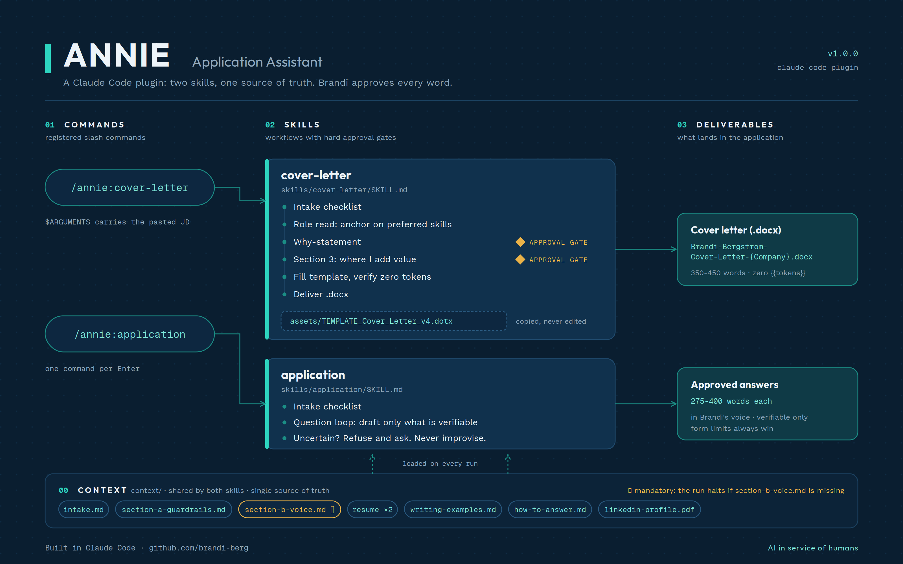
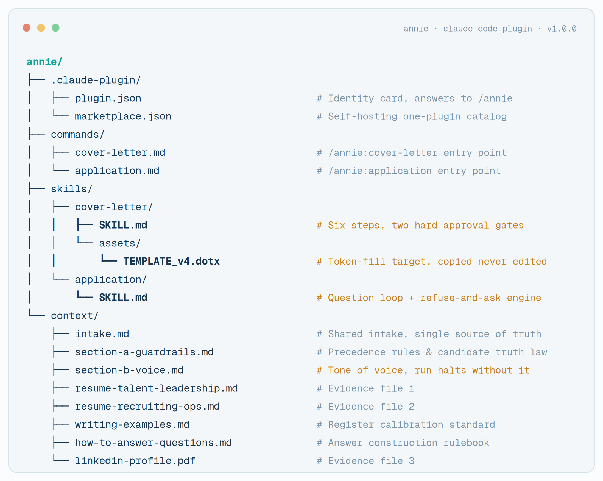

# Annie — Application Assistant

Job applications are the one of the first writing samples every company sees. Annie makes yours sharper: a Claude Code plugin that surfaces the strongest details of your experience and keeps you the final approver of every word. 



## Why Annie exists

Job applications matter. What you put in them is often the only writing sample a company sees before deciding to move you forward. That is why I built Annie: a Claude Code plugin that helps you surface the most compelling details of your experience while keeping you the final approver of every word. You validate your skills, tone of voice, impact, metrics, etc.

Annie is the sibling of [Gibbons](https://github.com/brandi-berg/gibbons), my agentic recruiting system. Gibbons works one side of the hiring desk; Annie works the other.

## What it does

**`/annie:cover-letter`** runs a six-step workflow: intake checklist, role read (anchored on preferred/bonus skills where you have verifiable evidence), a company-why statement you approve, a "where I add value" section you approve, then token-fills a Word template and delivers a finished .docx. 350-450 words, zero leftover placeholders.

**`/annie:application`** runs a question loop: paste an application question, get a draft in your voice built strictly from your own materials. The heart of it is the refuse-and-ask rule: if any part of an answer cannot be verified from your files, Annie refuses to improvise and asks you instead. A skipped answer with a good question beats a confident fabrication every time.

```
annie/
├── .claude-plugin/          # plugin.json + marketplace.json (self-hosting catalog)
├── commands/                # /annie:cover-letter and /annie:application
├── skills/
│   ├── cover-letter/        # SKILL.md + the .dotx template (copied, never edited)
│   └── application/         # SKILL.md
└── context/                 # the knowledge layer: generic rules ship, personal files are yours
```

## Design decisions worth stealing

1. **Approval gates are hard stops.** The why-statement and value section each require an explicit yes before Annie proceeds. AI drafts, human decides.
2. **Candidate truth rules.** Annie can only claim what appears verbatim in your resume, LinkedIn, or writing samples. Missing evidence returns "not stated" plus a question, never a guess.
3. **Personal context is gitignored by construction.** The repo ships the machinery; your voice file, resumes, and writing samples live only on your machine. You cannot accidentally commit them.
4. **The template is never edited in place.** Every run copies the .dotx, fills tokens, verifies zero `{{placeholders}}` remain, and delivers a fresh .docx.
5. **One source of truth for shared logic.** Both skills load the same `context/intake.md`, so intake rules are maintained in exactly one place.

## Install

```
/plugin marketplace add brandi-berg/annie
/plugin install annie@annie-marketplace
/reload-plugins
```

One command per Enter. Choose user scope so Annie follows you everywhere.

## Make it yours

Annie ships with my workflow and a blank knowledge layer. To run it as your own:

1. Open `context/` and fill in each `.example.md` template, then save copies without the `.example` suffix. Full instructions in [`context/README.md`](context/README.md).
2. Export your LinkedIn profile to PDF and drop it in as `context/linkedin-profile.pdf`.
3. Replace the cover letter template in `skills/cover-letter/assets/` with your own .dotx using tokens `{{Company Name}}`, `{{Job Title}}`, and `{{Company-why-statement}}`, or adapt yours to mine.
4. Run the refresh cycle (uninstall, marketplace update, install, reload) after any edit. Plugins are cached at install time.

The `section-b-voice.md` file is the one that matters most. Annie halts every run without it, on purpose: an application assistant with no voice file produces applications that sound like everyone else's.



## Stack

Built in [Claude Code](https://claude.com/claude-code) as a plugin: skills, commands, and a local marketplace. The cover letter mechanics manipulate OOXML directly (unzip, token replacement, content-type flip from template to document, rezip).

## License

MIT. Take it, rework it, ship your own version. If it lands you an interview, I want to hear about it.

---

*Built by [Brandi Bergstrom](https://brandi-berg.github.io/resume/) · [LinkedIn](https://www.linkedin.com/in/brandi-bergstrom/) · AI in service of humans*
